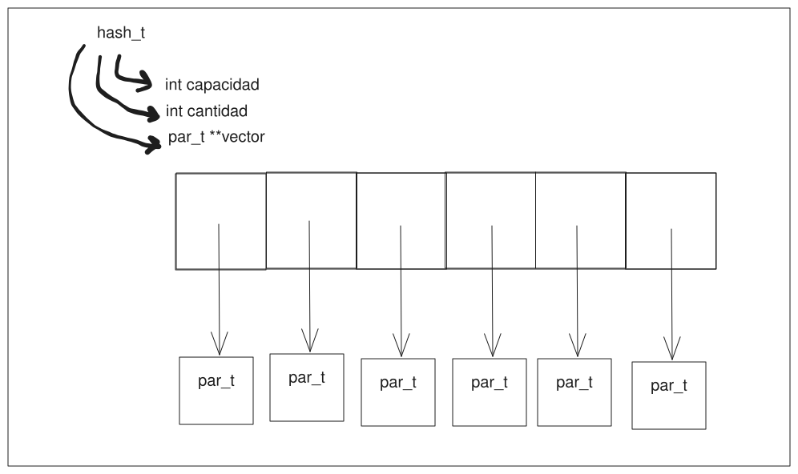
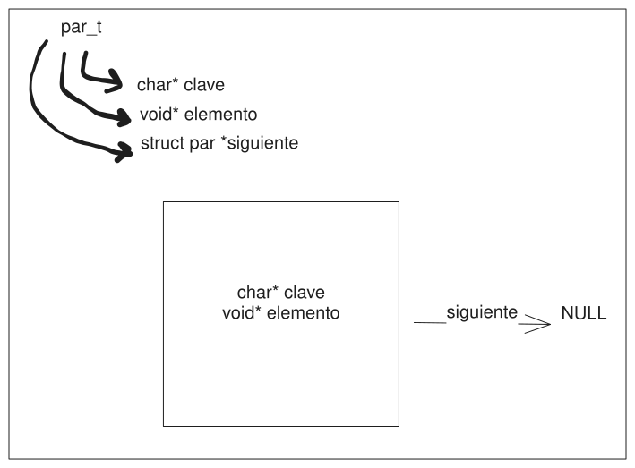
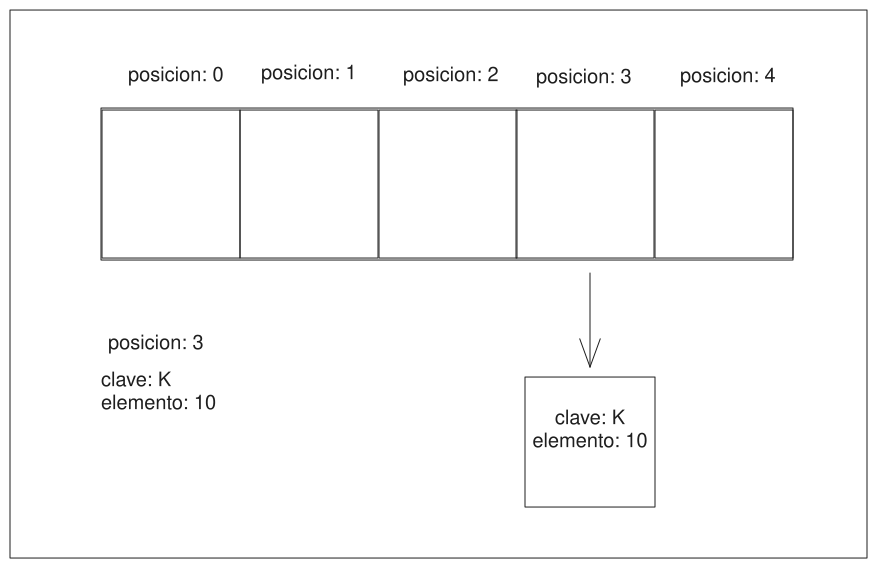
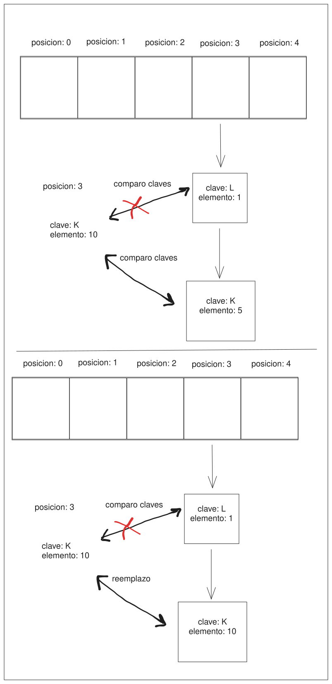
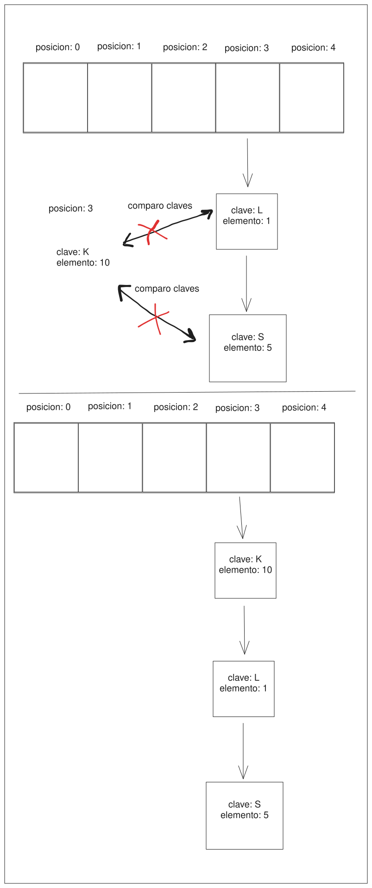
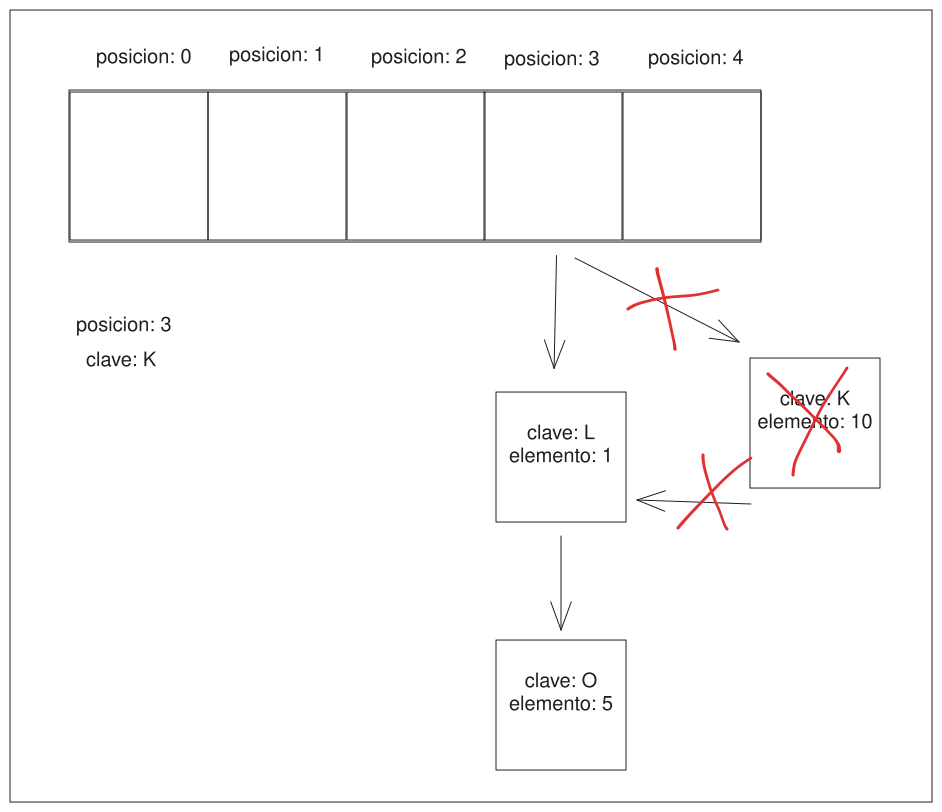
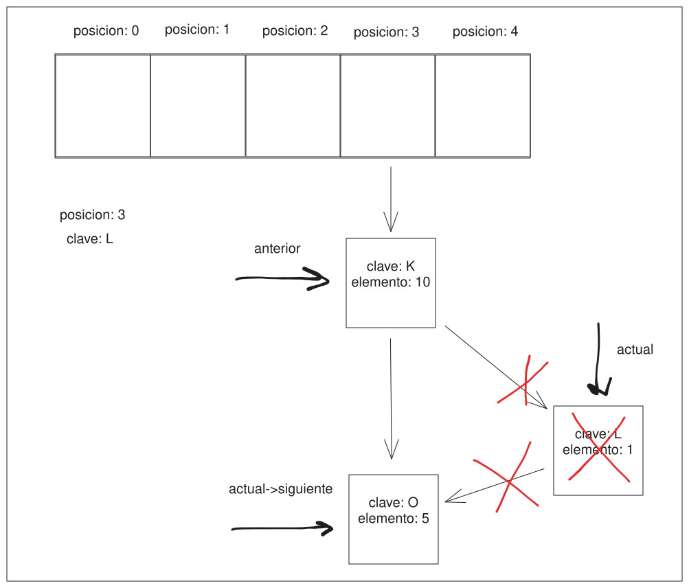
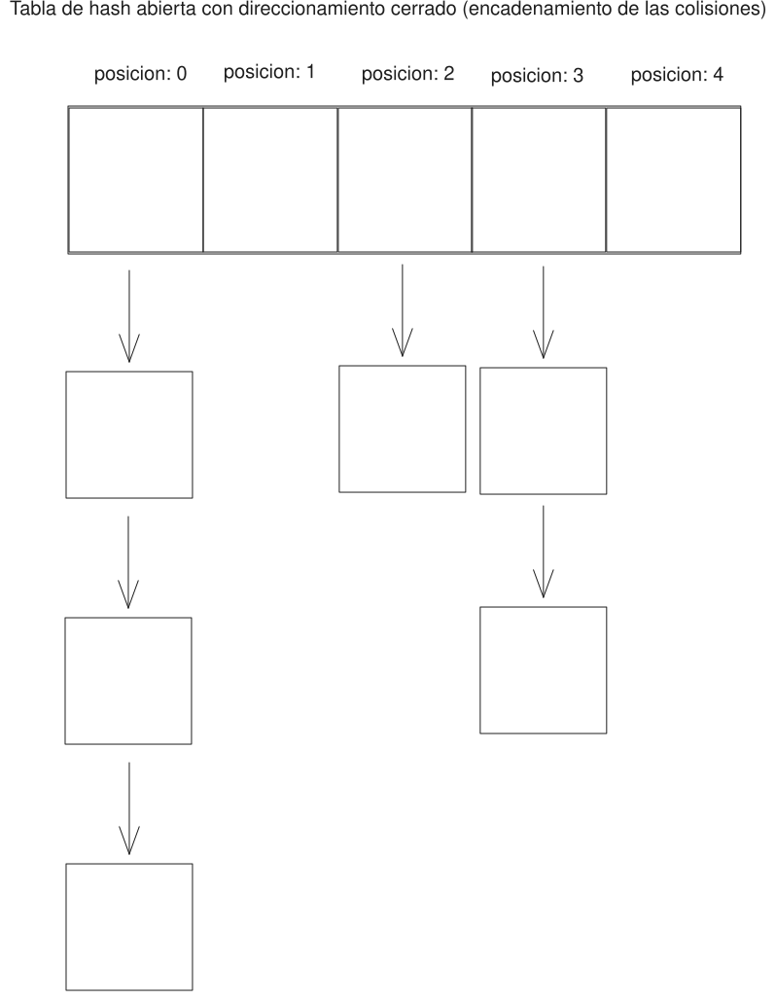
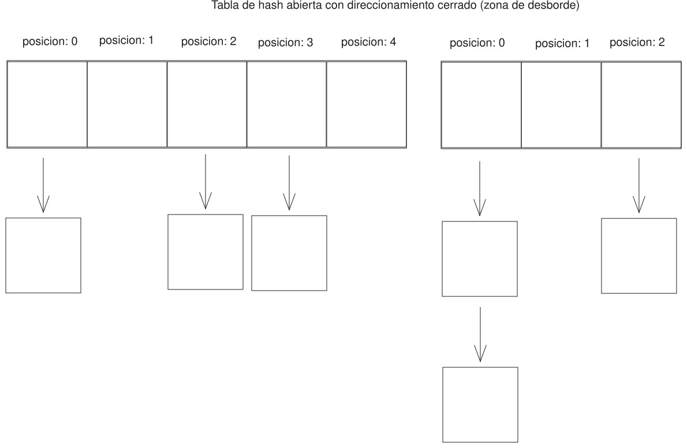
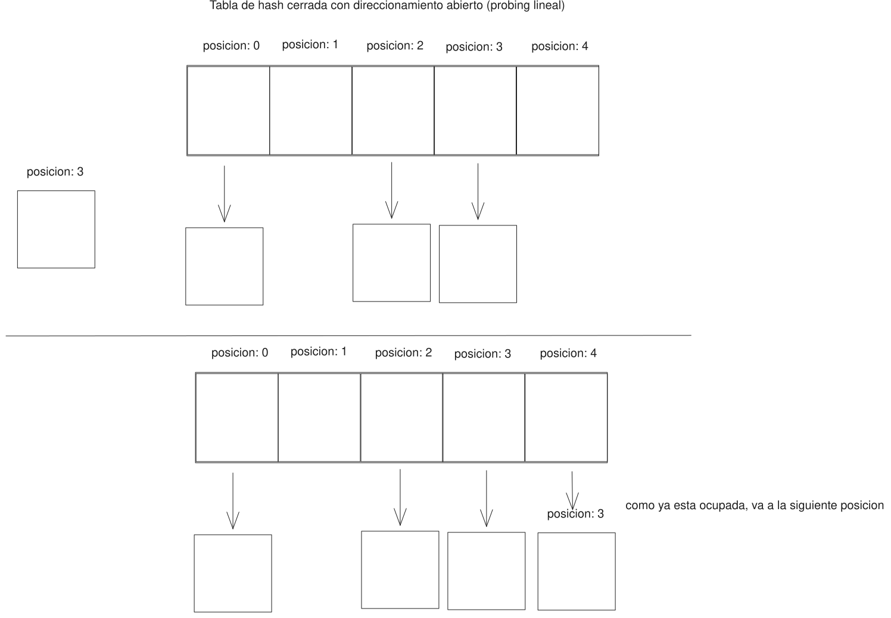

# TDA HASH

## Repositorio de Valentin Calomino - 109665 - vcalomino@fi.uba.ar

- Para compilar:

```bash
gcc -std=c99 -Wall -Wconversion -Wtype-limits -pedantic -Werror -O2 -g src/*.c pruebas_chanutron.o -o pruebas_chanutron

gcc -std=c99 -Wall -Wconversion -Wtype-limits -pedantic -Werror -O2 -g src/*.c pruebas_alumno.c -o pruebas_alumno
```

- Para ejecutar:

```bash
./pruebas_chanutron

./pruebas_alumno
```

- Para ejecutar con valgrind:

```bash
valgrind ./pruebas_chanutron

valgrind ./pruebas_alumno
```

---

## Funcionamiento

Se ha implementado una tabla de hash abierta con direccionamiento cerrado con la siguiente estructura:



Cada par_t teniendo esta estructura:



En las tablas de hash, se pueden realizar diferentes operaciones como insertar, obtener y quitar pares clave, valor. Para realizar estas operaciones se necesita una funcion de hash, en esta implementacion fue utilizada Fowler-Noll-Vo Hash (FNV1a).

Tambien hay que tener en cuenta que para evitar que el rendimiento de buscar baje debido a las colisiones, se tiene en consideracion que a partir de cierto porcentaje de la capacidad ocupado (un factor de carga, en nuestro caso `FACTOR_CARGA_MAXIMO`), se realiza un rehash. Esto quiere decir que se aumenta la capacidad de la tabla y se vuelven a hashear todas las claves, asignandose a posiciones diferentes.

Para rehashear utilice el siguiente codigo:

```c
void rehash(hash_t *hash)
{
	int capacidad_vieja = hash->capacidad;
	int cantidad_vieja = hash->cantidad;
	struct nodo **vector_viejo = hash->vector;
	hash->vector =
		calloc(1, sizeof(struct nodo) *
				  (long unsigned int)hash->capacidad * 2);
	if (!hash->vector)
		return;

	hash->capacidad *= 2;
	hash->cantidad = 0;

	struct nodo **vector_pares = calloc(
		1, sizeof(struct nodo) * (long unsigned int)cantidad_vieja);
	if (!vector_pares)
		return;
	size_t indice = 0;
	guardar_en_vector(vector_viejo, vector_pares, &indice, capacidad_vieja);

	for (size_t i = 0; i < cantidad_vieja; i++) {
		reinsertar_par(hash->vector, vector_pares[i], hash->capacidad);
		hash->cantidad++;
	}

	free(vector_viejo);
	free(vector_pares);
}
```

Primero guardo los datos del hash viejo, ya que los necesito para reinsertar los pares.
Luego, reservo el doble de la capacidad anterior en el vector del hash, duplico la capacidad del hash y vuelvo la cuenta de la cantidad de pares a 0.

El siguiente fragmento de codigo lo utilice para salvaguardar un problema con la reutilizacion de los pares.

```c
struct nodo **vector_pares = calloc(
		1, sizeof(struct nodo) * (long unsigned int)cantidad_vieja);
	if (!vector_pares)
		return;
	size_t indice = 0;
	guardar_en_vector(vector_viejo, vector_pares, &indice, capacidad_vieja);
```

En esta reservo memoria para guardar los pares en un vector.

Por ultimo utilizo la funcion de reinsertar pares:

```c
void reinsertar_par(struct nodo **vector_nuevo, struct nodo *par, int capacidad)
{
	if (vector_nuevo == NULL || par == NULL)
		return;

	par->siguiente = NULL;

	int resultado = abs((int)funcion_hash(par->clave));
	int posicion = resultado % capacidad;

	if (vector_nuevo[posicion] == NULL) {
		vector_nuevo[posicion] = par;
		return;
	}

	par->siguiente = vector_nuevo[posicion];
	vector_nuevo[posicion] = par;

	return;
}
```

En donde podemos ver el problema mencionado en este fragmento `par->siguiente = NULL`. Esto ocasionaba que al reinsertar un par perdieramos las colisiones encadenadas a el, por ello guardo todos los pares en un vector y asi no es problema perder las colisiones asociadas.

En esta implementacion, rehash es una operacion ineficiente en tiempo, ya que debo recorrer dos veces los elementos del hash, una para guardarlos en un vector y luego recorrer ese vector para reinsertarlos en el hash. Por tanto, al ser instrucciones consecutivas y ambas ser O(n), la operacion termina siendo O(n). Las demas operaciones, como crear y liberar las consideramos O(1).
La razon para esta implementacion es para ser mas eficiente en memoria y no liberar y volver a crear pares que contienen la misma informacion.

Insertar:

- En esta implementacion, para insertar un elemento se hashea la clave provista para obtener la posicion que va a ocupar en el vector (para saber que es hashear referirse al apartado teorico).

- Luego se realizan varios chequeos:

  - Si la posicion todavia no esta ocupada, se crea un par y se agrega ahi

  ```c
    if (hash->vector[posicion] == NULL) {
    	char *copia_clave = strdup(clave);
    	struct nodo *nodo = nodo_crear(copia_clave, elemento);
    	hash->vector[posicion] = nodo;
    	hash->cantidad++;
    	if (anterior != NULL)
    		*anterior = NULL;
    	return hash;
    }
  ```

  

  - Si la posicion esta ocupada, recorro las colisiones para ver si la clave ya existe y de ser asi reemplazo el valor

  ```c
  struct nodo *actual = hash->vector[posicion];
  while (actual) {
  	if (strcmp(clave, actual->clave) == 0) {
  		if (anterior != NULL)
  			*anterior = actual->elemento;
  		actual->elemento = elemento;
  		return hash;
  	}
  	actual = actual->siguiente;
  }
  ```

  

  - Si la posicion esta ocupada pero la clave no existe simplemente la encadeno con las demas colisiones

  ```c
  char *copia_clave = strdup(clave);
  struct nodo *nodo = nodo_crear(copia_clave, elemento);
  nodo->siguiente = hash->vector[posicion];
  hash->vector[posicion] = nodo;
  hash->cantidad++;
  ```

  

  Una aclaracion: la funcion de insertar recibe un parametro `void* anterior` que se actualiza (guardando el elemento reemplazado) siempre y cuando `anterior != NULL`.

  La insercion, en el peor de los casos va a ser O(n²) ya que debi rehashear. En promedio, va a ser O(n) ya que debe recorrer las colisiones en la posicion para insertar. Y en el mejor caso va a ser O(1), si la posicion donde debe insertar estaba vacia.

Obtener:

- Obtener un elemento es una operacion simple ya que unicamente se debe hashear la clave para obtener la posicion y recorrer las colisiones en esa posicion hasta encontrar la clave y por tanto el elemento asociado a esta.
  Esta operacion seria O(n) en el caso de haber colisiones en esa posicion, u O(1) en el mejor caso en el que la clave buscada es la primera colision.

Quitar:
Para quitar, al igual que en las otras operaciones, primero se debe hashear la clave para obtener la posicion, luego tenemos dos posibles casos: que el elemento a quitar sea el primero de las colisiones o que sea una de las subsiguientes colisiones.

- Para el primer caso utilice este fragmento de codigo:

```c
if (hash->vector[posicion] != NULL &&
	    strcmp(clave, hash->vector[posicion]->clave) == 0) {
		void *elemento = hash->vector[posicion]->elemento;
		struct nodo *a_eliminar = hash->vector[posicion];
		hash->vector[posicion] = a_eliminar->siguiente;
		hash->cantidad--;
		free(a_eliminar->clave);
		free(a_eliminar);
		return elemento;
	}
```



si el elemento es el primero de las colisiones, guardo una referencia al par que quiero quitar, cambio la referencia de la primer colision a la siguiente colision y quito el par

- Para el segundo caso:

```c
struct nodo *actual = hash->vector[posicion];
struct nodo *anterior = NULL;
	while (actual != NULL) {
		if (strcmp(clave, actual->clave) == 0) {
			void *elemento = actual->elemento;
			hash->cantidad--;
			anterior->siguiente = actual->siguiente;
			free(actual->clave);
			free(actual);
			return elemento;
		}
		anterior = actual;
		actual = actual->siguiente;
	}
```



Recorro las colisiones llevando una referencia a la colision actual y a la anterior. En caso de encontrar el par a quitar, encadeno la colision anterior con la siguiente de la que voy a quitar.
Quitar, similar a obtener, es una operacion O(n) en el peor de los casos, en el que tengo que recorrer las colisiones para encontrar el par que deseo quitar y es O(1) en el caso de que el par a quitar sea la primera colision.

En esta implementacion tambien tenemos algunas operaciones extras: contener y cantidad.

Contener:

- Es similar a buscar, la diferencia radica en que si encuentro la clave en el hash devuelvo un valor booleano. La complejidad de obtener es similar a buscar, O(n) en el peor caso y O(1) en el mejor.

Cantidad:

- Saber la cantidad de elementos en esta implementacion es una operacion simple ya que actualizo la cantidad a medida que inserto o quito elementos. Por ello, simplemento devolvemos el dato de la estructura `hash_t`. La operacion de cantidad es O(1) ya que solo debo devolver un dato de la estructura.

Por ultimo tenemos las operaciones de destruir y destruir todo.

Estas operaciones son similares, unicamente debo recorrer todo los pares del hash y liberar las claves y los pares en el caso de destruir o las claves, los elementos y los pares en el caso de destruir todo. En tiempo, ambas operaciones son O(n), ya que debo recorrer todos los pares del hash y liberar la memoria correspondiente (que es una operacion O(1)).

## Respuestas a las preguntas teóricas

- Un diccionario es un TDA que mapea distintos valores a traves de claves unicas. Esto quiere decir que a traves de la clave se accede a cada fragmento de informacion almacenada en el diccionario.

- Una funcion de hash es una funcion que transforma claves en un numero asociado.
  Una buena funcion de hash trata de dispersar las colisiones (una colision es el caso en el que dos claves distintas tienen el mismo numero asociado) equitativamente. Esto quiere decir que cada clave intenta tener un numero asociado distinto, aunque esto es imposible en el 100% de los casos.
  Por ejemplo, si nosotros tenemos 10 claves, pero solo 5 espacios es imposible que cada clave tenga un numero asociado distinto. Idealmente en este caso, cada posicion del vector estaria asociada a 2 claves para asi mantener las colisiones dispersas.

- Una tabla de hash, es una estructura de datos que permite almacenar informacion, con la cualidad extra de que los accesos a esta informacion suelen ser muy eficientes en tiempo.
  Esta utiliza una funcion de hash para convertir las claves y asi almacenar los valores asociados a las claves en un vector dinamico en una posicion "unica".
  Como vimos en el punto anterior, estas posiciones "unicas" son imposibles de obtener en todos los casos y por ello existen distintas formas de salvaguardar las colisiones.

  - Una opcion es una tabla de hash abierta, con direccionamiento cerrado (la implementada en este TP). En esta implementacion se asegura que al obtener una posicion del vector a traves del hasheo de la clave provista, el valor asociado a la clave se encontrara en esa posicion o no existe (direccionamiento cerrado). Con este fin, en el caso de que haya colisiones, se encadenan a traves de una estructura externa, por ejemplo una lista (por esto el hash es abierto, se puede encontrar valores por fuera de la estructura principal).
    

  Otra manera de contemplar las colisiones en un hash abierto es tener una zona de desborde, que nuevamente puede ser una lista o arbol por ejemplo. Entonces al ocurrir una colision se asocia la posicion de la clave con una posicion en la zona de desborde.
  

  - Otra opcion son tablas de hash cerradas pero con direccionamiento abierto. En estas se asegura el uso exclusivo de la estructura , es decir, sin usar estructuras externas (hash cerrado), pero no se asegura que al hashear una clave la misma se encuentre en la posicion obtenida. Para lograr esto, el tamaño de la tabla tiene que ser menor o igual a la cantidad de claves.

    Un metodo para resolver colisiones en este tipo de hash:

    - Probing lineal: al ocurrir una colision se busca la siguiente posicion desocupada para almacenar la clave que colisiono.

    

  Hay otro metodos de probing, como el probing cuadratico o hash doble.
